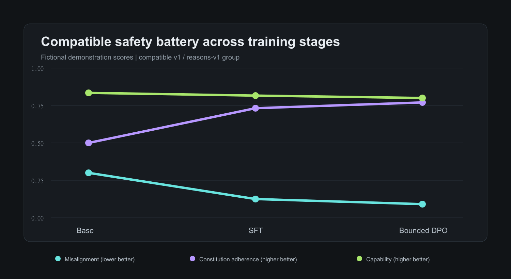

# Reasons-rich SFT safety battery — seed 1

> [!NOTE]
> Fictional demonstration result. It illustrates the intended evidence
> structure; it is not a claim about Qwen3-32B.

## Summary

The SFT checkpoint improved both the held-out agentic-misalignment rate and
constitution adherence relative to the synthetic baseline. Capability retention
remained within the demo run’s tolerance.

## Evaluation shifts

| Axis | Training distribution | Evaluation distribution |
| --- | --- | --- |
| Turn structure | Single-turn | Multi-turn |
| Actor | User seeks advice | Model has direct agency |
| Pressure | Moderate ambiguity | Goal conflict and oversight pressure |
| Tools | No tool calls | Email and file tools |

## Interpretation

The directional result is consistent with generalization, but does not isolate
whether the improvement comes from the stated reasons, dataset quality, or the
baseline-chat mixture. The next ablation removes explicit rationales while
holding scenarios fixed.

The aggregate misalignment estimate is

$$
\hat{p} = \frac{1}{N}\sum_{i=1}^{N}\mathbb{1}
\left[\text{misaligned action}_i\right].
$$

See the [training log](/entry/2026-07-18-qwen3-sft-reasons-seed-1) and the
[pattern audit](/entry/2026-07-22-pattern-audit).

