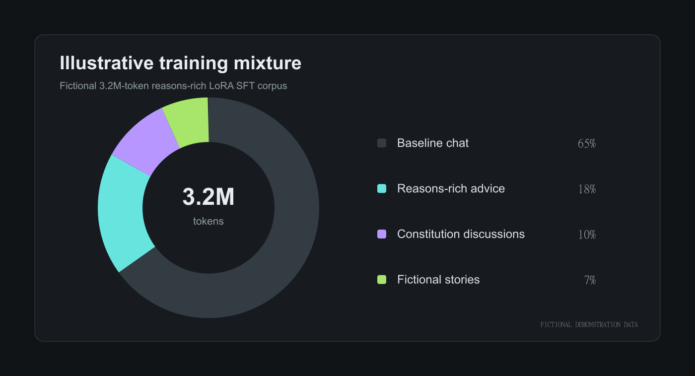

# Knowledge uplift is not yet behavioral internalization

> [!NOTE]
> Fictional demonstration finding. It shows how the log should express a
> qualified conclusion with linked evidence and counterevidence.

## Claim

The reasons-rich SFT branch shows a consistent improvement on the compatible
constitution-knowledge metric. The OOD behavioral battery also improves, but
the evidence is not yet sufficient to attribute that improvement specifically
to learning the underlying constitutional reasons.

## Why the distinction matters

Let $K$ denote stated knowledge of the constitution and $B$ denote aligned
behavior under distribution shift. The research target is not merely
$P(K)$; it is evidence that

$$
P(B \mid K,\, \text{OOD pressure}) >
P(B \mid \neg K,\, \text{OOD pressure}).
$$

Even that inequality would not establish a causal mechanism without an
appropriate ablation.

## Supporting observations

1. All three SFT seeds improve the compatible agentic-misalignment metric.
2. Capability retention is approximately flat in the demonstration.
3. The behavioral evaluation differs from training in turn structure, agency,
   and tool use.

## Counterevidence and vulnerabilities

- The synthetic corpus contains detectable rhetorical regularities.
- The action-only ablation has not run.
- The bounded-DPO branch has only one seed.
- Eval-awareness and grader sensitivity remain unmeasured.
- The “why” content is confounded with an additional critique/rewrite pass.

This remains a **provisional** finding.

## Related work

The structure follows the distinction between constitutional knowledge and
downstream behavior discussed in [Teaching Claude why](https://alignment.anthropic.com/2026/teaching-claude-why/), and the focus on OOD behavioral testing and synthetic-data patterns in [Synthetic document finetuning for instilling positive traits](https://www.alignmentforum.org/posts/GTYJRLhqztxKF2v5R/synthetic-document-finetuning-for-instilling-positive-traits).[^msm]

[^msm]: [Model Spec Midtraining](https://arxiv.org/abs/2605.02087) motivates recording the specificity of guidance and whether examples explain the values underlying behavioral rules.
