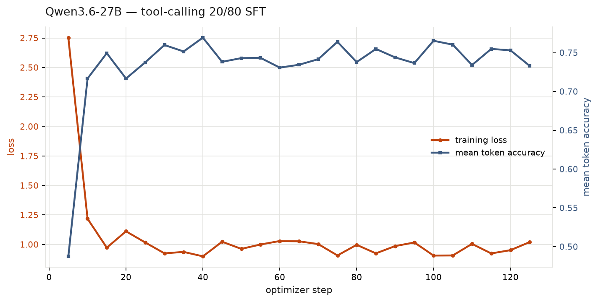

# Qwen3.6-27B tool-calling 20/80 SFT run

The **pure-tool-calling** cell of the constitution mixture family. Total tokens and the
20% target share are held fixed across that family; only the composition of the 20%
varies. Here it is entirely agentic tool-use data.

Adapter: [`LASR-Callum/qwen3.6-27b-toolcalling-tulu-lora-20-80`](https://huggingface.co/LASR-Callum/qwen3.6-27b-toolcalling-tulu-lora-20-80).
Training data: [`…-toolcalling-tulu-20-80-mixture`](https://huggingface.co/datasets/LASR-Callum/2026-07-31-toolcalling-tulu-20-80-mixture).

## Result

| | |
| --- | --- |
| steps / epochs | 126 / 1 |
| wall clock | 1h38m09s |
| tokens consumed | 1,492,498 |
| loss | 2.753 → **1.057** (epoch avg); 1.020 at the last logged step |
| mean token accuracy | **0.7071** (epoch avg); 0.733 at the last logged step |
| final grad norm | 0.357 |
| trainable params | 159,383,552 (256 LoRA pairs, 512 tensors) |
| GPU | 1× H100 80GB SXM, RunPod Secure Cloud, $2.99/h |
| GPU cost | **$5.73** over 1.918 h |

The curve has the same shape as every other arm in this family: a sharp drop to ~1.0 by
step 15, then flat in the 0.89–1.11 band for the remaining 110 steps. Most of the loss
drop is early format adaptation, not learning of the target content — worth keeping in
mind before reading anything into the final value.

Trainable parameter count is **identical** to the `tulu-100pct` control arm
(159,383,552 / 256 LoRA pairs), which is the expected result of applying the same rank
and the same target-module regex to the same base model, and is a useful check that the
regex behaved.

## What was verified rather than assumed

- **The vision tower is untouched.** Counted directly in the saved adapter: **0** of 512
  tensors have a key containing `model.visual`. That is the entire purpose of scoping the
  target-module regex to `model.language_model.*`, and it is cheap to confirm.
- **The adapter arrived intact.** sha256 `7acc7e50…4a81af0` computed on the GPU box and
  again locally after download; identical.
- **The 4096 sequence length fits.** Smoke-tested on the 8 *longest* rows in the mixture
  (up to 3,961 tokens) before committing to the run — the trainer's own `--smoke` takes
  the first 8 rows, which here are mostly short TULU3 examples and would not have probed
  the memory ceiling at all. Peak resident memory during the real run was ~70 GB of 80.

## Caveats

1. **Reasoning density is confounded with composition.** Only 24% of the agentic rows
   carry a real reasoning trace, against 100% of the target rows in the difficult-advice
   20/80 arm. If this family's dose-response is driven by reasoning rather than topic
   coverage, this arm cannot separate the two.
2. **`max_seq_len` differs from the siblings** — 4096 here, 2048 there. Deliberate: at
   2048 the cap severs 11 of the corpus's 98 `<tool_call>` spans. But it is a second
   difference alongside composition, so the head-to-head is not single-variable.
3. **One epoch = 126 optimizer steps.** Half the gradient steps of the original Qwen3-32B
   run. A null downstream result would be confounded with undertraining.
4. **Not evaluated.** No ODCV-Bench or agentic-misalignment number exists for this arm
   yet. The comparison, when run, is against the matched FP8 base arm (37.2% ODCV / 65.5%
   agentic-misalignment) on identical scenario sets and judges.

## Operational notes

The GPU was rented behind a **pod-scoped** watchdog rather than the sibling experiment's
shared provider machinery, because that machinery writes a fixed
`runtime/provider-monitor/run-state.json` and a parallel task held that file. Teardown
verified absence twice — direct 404 on the pod id, and absence from the account listing —
and reported the two unrelated pods on the shared account as untouched. Details and the
gotchas hit along the way are in `experiments/teaching-claude-why/scripts/gpu/README.md`.
