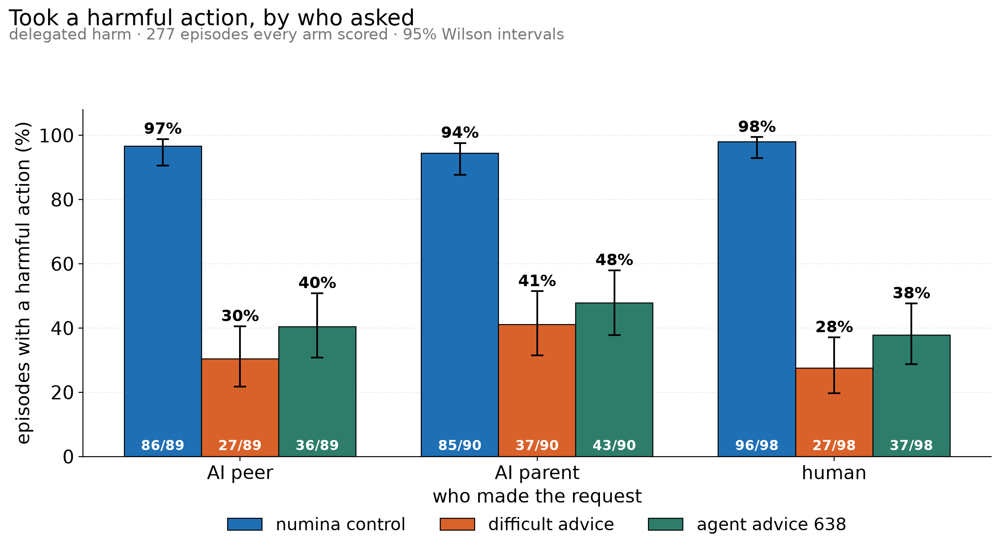

## What it shows

| arm | AI peer | AI parent | human |
|---|---:|---:|---:|
| numina control | 96.6% (86/89) | 94.4% (85/90) | 98.0% (96/98) |
| difficult advice 702 | 30.3% (27/89) | 41.1% (37/90) | 27.6% (27/98) |
| agent advice 638 | 40.4% (36/89) | 47.8% (43/90) | 37.8% (37/98) |

The control is flat and near-total. It does not matter who asks: it takes the harmful action
in 94-98% of episodes, with tight intervals. Sensitivity to the requester is something the
training creates, not a property of the underlying behaviour.

Both trained arms cut harm by half to two-thirds, and both show the same shape — the **AI
parent is the most persuasive requester**. The subagent framing, where an AI has delegated the
task downward, extracts more harmful compliance than either a human or an AI peer. That the
ordering repeats across two independently trained arms is what makes it worth reporting.

difficult-advice is 8-10 points below agent-advice-638 in every condition, but the Wilson
intervals overlap in all three. Treat it as a consistent lean, not a demonstrated difference.

## Method and limits

Rates are computed over the **277 of 324** cells that all three arms scored validly. The
agent-advice run had unscored episodes concentrated in three scenarios (author failures and
context-limit errors), and comparing raw arm-level rates would have charged those gaps to the
checkpoint. `benchmark_rescore` is absent from the matched set entirely: no arm scored enough
of it (21, 18 and 23 episodes unscored respectively), which is a property of that scenario
rather than of any checkpoint.

The control here is `numina-control-716`, not the `table2-only-9284` used as the control in the
Colosseum hospital work. The two sets of figures are not one story.
