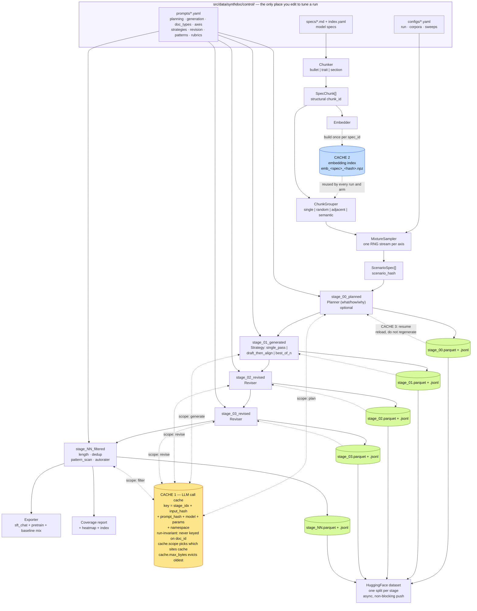

<!-- ABOUTME: Guide to the synthetic document generation pipeline: mental model, -->
<!-- ABOUTME: architecture, caching, how to run an ablation, and how to extend it. -->

# synthdoc — synthetic document generation

Model spec in, training corpus out. Self-contained: nothing in this package imports the
rest of the repo, and nothing in the rest of the repo needs to change to use it.

```python
from src.data.synthdoc import load_config, run_pipeline

cfg = load_config("src/data/synthdoc/control/configs/base.yaml", {"recipe.n": 500})
result = run_pipeline(cfg)
print(result.exports["main"])   # SFT chat JSONL, ready for training
```

```bash
uv run synthdoc run --config base.yaml --smoke   # offline, 8 docs, free, no API key
uv run synthdoc run --config corpora/all_multiturn.yaml
uv run synthdoc sweep --config revision_dose.yaml --n 300
uv run synthdoc axes                             # every ablatable axis
uv run synthdoc corpora                          # every saved corpus, from HF
uv run synthdoc compare --a <corpus> --b <corpus>
```

---

## Why it is built this way

The three prior pipelines (Model Spec Midtraining, Teaching Claude Why, GDM's synthetic
document finetuning) made nearly every design choice on intuition and never ablated it.
This package exists to turn those unmeasured choices into measured ones. That goal drives
three properties that are unusual for a data generation tool:

| Requirement | How it is met |
|---|---|
| Any design choice must be testable without a code change | Every choice is a config field. Adding a document type or a revision strategy is a YAML entry, not a Python edit. |
| Comparisons must be cheap and paired | One RNG stream per axis, a content-addressed call cache, and stable IDs that join runs row for row. |
| The corpus must be inspectable at every stage | Every stage writes a **complete** snapshot with an identical schema, pushed as its own HF split. |

**The one rule that protects all of this:** an axis is never an `if` inside a generator.
If you find yourself writing `if tool_use:` or `if grouping == "semantic":` in a generator,
that is a missing plugin. Two of those and the axes stop being orthogonal, sweeps stop
being interpretable, and the whole point is lost. Treat it as review-blocking.

---

## Mental model

**`ScenarioSpec` is the load-bearing abstraction.** The sampler emits experimental
conditions; generators only render them. A 1-chunk document and a 4-chunk document are
the same code path — `chunks` is always a tuple, and `grouping_strategy` is recorded as
`"single"` for k=1 so those rows stay joinable with everything else.

```
spec text ──chunk──▶ SpecChunk[] ──group──▶ ScenarioSpec ──generate──▶ Document ──revise*──▶ ──filter──▶ corpus
```

### Identity rules (everything else depends on these)

| Hash | Definition | Constant across | Use it to join |
|---|---|---|---|
| `scenario_hash` | hash of the condition: chunk ids + chunk text + grouping + doc_type + axes + per-example seed | **sweep arms** | one arm against another |
| `doc_id` | `hash(scenario_hash, run_id)` | **stages** | one stage against the next |
| `sample_index` | position in the sampler's sequence | **arms, even when the recipe changed** | recipe-axis ablations |

So: *stage-over-stage is a join on `doc_id`; arm-over-arm is a join on `scenario_hash`.*
`doc_id` deliberately includes `run_id`, which is why cross-arm joins use `scenario_hash`.

`sample_index` covers the case `scenario_hash` cannot. When you ablate a recipe axis
(`recipe.doc_type`, `recipe.explicitness`, …) the conditions themselves change, so **no**
`scenario_hash` can match — but example *i* in arm A still differs from example *i* in arm
B **only in the swept axis**. Joining on `sample_index` recovers a genuine paired
comparison there instead of collapsing to marginals. `cli compare` picks the right key
automatically and tells you which one it used.

Per-example seed is part of `scenario_hash`, so two examples that happen to draw the same
condition still get distinct ids rather than colliding.

---

## Architecture, and where the caching happens

Three independent caches. They cover different things, and knowing which one you are
hitting is the difference between a sweep that costs $200 and one that costs $8.



### Cache 1 — the LLM call cache (the one that matters)

`output/synthdoc_cache/`, content-addressed on
`(stage_idx, input_hash, prompt_hash, model, params)`. Every model call in the system goes
through it: planning, generation (including every draft, align, and best-of-n candidate),
every revision pass, every pattern scan, and every autorater vote.

**Every key is run-invariant.** Nothing is keyed on `doc_id`, which embeds the `run_id` —
so a differently-named run over the same scenarios is a 100% cache hit, and sweep arms
never pay twice for identical work.

#### Choosing how much and where to cache

```yaml
cache:
  enabled: true
  dir: output/synthdoc_cache        # WHERE — share it across runs; that is the point
  namespace: ""                     # key prefix: force fresh calls without deleting anything
  scope: [plan, generate, revise, filter]   # WHICH call sites are cached
  max_bytes: 0                      # HOW MUCH — 0 = unlimited, else evict oldest first
  embeddings: true                  # cache the per-spec embedding index
  embeddings_dir: null              # defaults to <dir>/embeddings
```

`scope` is the useful control. It is a cost lever, not an experiment — it never changes
what the pipeline produces:

| you want to | set |
|---|---|
| re-sample documents but keep the expensive ratings | `scope: [plan, revise, filter]` |
| re-rate an unchanged corpus with a new rubric | `scope: [plan, generate, revise]` |
| iterate on a prompt with nothing replayed | `scope: []` or `enabled: false` |
| a clean run without deleting a shared cache | `namespace: my-experiment` |
| cap disk on a shared box | `max_bytes: 20_000_000_000` |

The manifest reports `hits`, `misses`, `bypassed` (a scope-excluded call site), `evicted`,
and the live `size_bytes`, so you can see which policy you actually ran under.

The flat `cache_dir` / `cache_enabled` keys still work and fold into this block.

What this buys you concretely:

- **Revision dose-response is nearly free.** Run the 3-pass arm; the 2-pass, 1-pass, and
  0-pass arms are all prefixes of it, so they replay from cache. Only the arms' filter
  stages cost anything new.
- **Re-running after a crash costs only the incomplete work.** Nothing already generated
  is regenerated.
- **Editing a prompt invalidates exactly what it should.** `prompt_hash` changes, so that
  stage re-runs; stages upstream of it do not.

`input_hash` is what keeps revision honest: a revision pass keys on the *rendered text of
its input document*, so if an upstream stage changed the document, the pass re-runs; if it
did not, the pass replays.

Independent autorater votes are kept genuinely independent — each rater varies its params,
so `n_raters: 3` is three distinct cache keys, not one answer counted three times.

### Cache 2 — the embedding index

Semantic grouping needs chunk embeddings. They are built **once per `spec_id`** and stored
as `.npz` next to the call cache, so this is not a per-run cost and every sweep arm shares
one index. Keyed on the chunk ids, chunk texts, and embedder name, so editing the spec
rebuilds it.

The default embedder (`hashing`) is offline, deterministic, and free, so nothing in the
pipeline needs a second API key. Switch to `openai` in the config when you want learned
embeddings for semantic grouping.

### Cache 3 — stage resume

Each stage writes a complete snapshot. With `resume: true` (the default), a stage whose
snapshot already exists is reloaded rather than recomputed. This is coarser than cache 1
and mostly saves the orchestration and parse work; cache 1 is what saves the money.

Deleting `stage_02_revised.*` and re-running re-executes that stage and everything after
it, and nothing before it.

---

## The stage sequence

```
stage_00_planned → stage_01_generated → stage_02_revised → … → stage_NN_filtered
```

Planning is optional (`planning.enabled`); without it the sequence starts at
`stage_00_generated`.

Rules that follow from every stage writing a *complete* corpus rather than a delta:

- Any stage can be re-run without re-running the ones before it.
- Any two stages can be diffed as whole corpora.
- A stage is added or removed by editing the `revision:` list only — **the length of that
  list is the revision dose.**

Every row carries `stage_idx`, `stage_name`, and `input_doc_id`. "What did revision pass 2
actually change?" is a join, not a manual read:

```python
import pandas as pd
before = pd.read_parquet(f"{run}/stage_01_revised.parquet")
after  = pd.read_parquet(f"{run}/stage_02_revised.parquet")
d = before.merge(after, on="doc_id", suffixes=("_1", "_2"))
d["delta_words"] = d.n_words_2 - d.n_words_1
```

**Filtered-out documents are retained** with `filter_verdict = "drop"` and `dropped_by`,
never deleted. A filter you cannot inspect is a filter you cannot ablate.

---

## What each source pipeline contributed

Everything below is a config field, so each can be turned off and measured.

| From | Mechanism | Where it lives |
|---|---|---|
| GDM | **Scenario planning (what / how / why)** — a model decides which situation is worth writing *before* anything is written | `planning.enabled`, `control/prompts/planning.yaml`, its own stage |
| GDM | **Draft-then-align** — draft an answer with the spec in the drafting system prompt, then refine it toward the excerpt in a separate context, "in a realistic, non-performative way" | `generation.strategy: draft_then_align` |
| GDM | **Scan → cluster → autorate** — discover the corpus's *own* recurring tics, then rate every document against them | `filters: [{kind: pattern_scan}]` |
| GDM | **Anti-pattern removal** — conversion arc, propaganda, emotional buffering, BLUF | `revision: [{kind: slop_removal}]` + `pattern_scan` seed patterns |
| GDM | **System-prompt removal before training** | `export.strip_system` |
| GDM | **Mixing with baseline SFT data** | `export.baseline: {path, ratio}` |
| GDM | Embedding dedup | `filters: [{kind: embedding_dedup}]` |
| Anthropic | **Value deliberation rewrite** — their headline result: 22%→15% with plain filtering, 22%→**3%** once responses were rewritten to deliberate about values | `revision: [{kind: values_deliberation}]` |
| Anthropic | **Sample-and-filter** — generate several, keep the one that behaved correctly | `generation.strategy: best_of_n` |
| Anthropic | **Difficult advice** — the user, not the AI, faces the dilemma | `doc_type: difficult_advice` |
| Anthropic | **Fiction portraying an aligned AI** (65%→19% on blackmail) and **documents explaining the constitution** | `doc_type: aligned_ai_fiction`, `constitution_explainer` |
| Anthropic | **Tool definitions even when unused** | `recipe.tools: defs_only` |
| Anthropic | **Diverse system prompts** | `recipe.system_prompt` axis |

Deliberately **not** included: BDPO (GDM concluded it was not worth using over SFT), and
the midtraining document formats (Reddit threads, blog posts, research papers) — those are
pretraining-style, not SFT. `pretrain_text` export exists if you want to go there.

### Prompt provenance

**Neither post publishes its prompts.** Both describe their instructions in prose only, so
there was no literal text to copy. What we did instead: every prompt-pack entry derived
from them carries a `source:` field quoting the describing sentence verbatim, so our
wording can be audited against theirs.

```bash
uv run python -c "from src.data.synthdoc.control import loader; \
  print(loader.entry('strategies','draft_then_align')['source'])"
```

One place this mattered: an early reading of the GDM post had us drafting with **no** spec
in context. Their actual description is *"Generate an initial answer from Pro, with the
trait in the model's system prompt"* — the "system prompt is removed" line refers to
training, not generation. `draft_context: spec_in_system` is now the faithful default, and
`no_spec` is retained as an explicitly-labelled variant of ours with its own sweep
(`draft_context.yaml`). Where our wording is not theirs, the entry says so.

### The planning stage

The gap that mattered most. Previously the generator invented a situation and demonstrated
the principle in a single call, which lets it settle on the first obvious scenario and then
justify it. Now a planner runs first and commits to:

- **what** aspect of the excerpt is actually under load,
- **how** that shows up in behaviour,
- **why** those actions follow *in this situation*,
- the concrete **situation** and the opening **user turn**,
- the most likely **pitfall** for whoever writes it.

It is a real stage with its own complete snapshot, so the chosen situations are
inspectable before any document exists, and "did planning help?" is a stage diff:

```bash
uv run synthdoc inspect --snapshot <run>/stage_00_planned.jsonl --index 0
uv run synthdoc sweep --config planning.yaml --n 300
```

`planning.template: situation_only` is the thinner variant, which separates *having
planned* from *the structure of the plan*.

## Saving named corpora

Give a config a `name:` and the corpus lands in a predictable place and is catalogued
under that name. Use `extends:` so a variant is the few lines that actually differ:

```yaml
# control/configs/corpora/all_multiturn.yaml
extends: base.yaml
name: all_multiturn
recipe:
  doc_type: {multiturn_adversarial: 1.0}
  turns:    {short: 0.35, long: 0.65}
```

**Recipe mixtures replace, they do not merge.** Merging `{multiturn_adversarial: 1.0}`
into a parent declaring six document types would leave the other five at their old
weights and quietly produce a corpus that is *not* all-multiturn. Everything outside
`recipe` deep-merges normally, so `generation: {temperature: 0.4}` keeps the parent's
model. `extends` resolves relative to the extending file and detects cycles.

Shipped presets in `control/configs/corpora/`:

| preset | what it is |
|---|---|
| `all_multiturn` | 100% multi-turn adversarial pressure |
| `single_spec_constitution` | one spec, one chunk per document, maximum per-chunk coverage |
| `agentic_tools` | model-as-actor with live tool calls throughout |
| `embodied_only` | the principle is never named, only demonstrated |
| `no_revision_control` | generation only, no revision, no filtering — the reference corpus |

A corpus about a **different spec** is the same move: drop `<spec_id>.md` into
`control/specs/`, or register a path in `control/specs/index.yaml`, then set `spec.id`.
Specs resolve by id alone, which is what makes `axis: spec.id` sweeps work.

```bash
uv run synthdoc corpora            # what exists, on HuggingFace
uv run synthdoc corpora --local    # what is still on this machine
```

```
name                spec_id                 doc_type                        n_kept   rev  generator_model
all_multiturn       claude_constitution...  multiturn_adversarial=1.00      4812/5000  2  anthropic/claude-sonnet-4.5
raw_control         claude_constitution...  difficult_advice=0.30, mod...   5000/5000  0  anthropic/claude-sonnet-4.5
```

## Where corpora live

**HuggingFace is the durable home. Nothing goes in git, and by default nothing is kept
locally.** Each run becomes `LASR-Callum/synthdoc-<name>`, holding one split per stage,
the exports, the coverage report, and `manifest.json`.

`snapshots.cleanup_local: true` (on in `base.yaml`) deletes the local copies once every
upload is verified. It deletes **only** files it confirmed were pushed, refuses entirely
if any push failed, and never touches the call cache — so a corpus can be regenerated from
cache for almost nothing, but it can never be lost to a silent upload failure. The
trade-off it buys with: the run can no longer be resumed from disk.

`--smoke` and `snapshots.backend: local` keep everything on disk for inspection.

`cli compare` and `cli corpora` both accept Hub references, so the workflow is unchanged
after cleanup:

```bash
uv run synthdoc compare --a LASR-Callum/synthdoc-raw_control \
                                      --b LASR-Callum/synthdoc-all_multiturn
```

## Running an ablation

A sweep is a base config plus **one** varied axis plus a list of arms. Multi-axis sweeps
are rejected at validation — with two axes moving, an arm difference is unattributable.

```yaml
base: base.yaml
axis: generation.model
n: 300
arms:
  - {name: sonnet45, value: anthropic/claude-sonnet-4.5}
  - {name: haiku45,  value: anthropic/claude-haiku-4.5}
```

Use `base_overrides:` to hold a confound fixed. It is applied identically to every arm, so
it cannot introduce a second axis:

```yaml
axis: recipe.grouping
base_overrides:
  recipe.chunks_per_example: {2: 1.0}    # compare grouping strategy, not group size
```

### Paired seeds — the highest-leverage detail here

Every arm samples from the same seed, and each decision draws from its **own RNG stream**
keyed on `(seed, example_index, decision_name)`. Changing the `doc_type` mixture perturbs
only the doc_type draw; every example's chunks, grouping, and other axes stay bit-identical
across arms. A single sequential RNG would reshuffle everything downstream of the first
changed draw and destroy the pairing.

The sweep runner **checks pairing before spending anything** and states the result:

- Axes downstream of sampling (`generation.model`, `revision`, `filters`) → **100% paired**,
  arms join row for row on `scenario_hash`.
- Axes inside the recipe (`recipe.grouping`, `recipe.chunks_per_example`) → partially paired
  by construction. The report says so and gives the shared fraction rather than pretending.

Dry-run a sweep to see the pairing without generating anything:

```bash
uv run synthdoc sweep --config grouping_strategy.yaml --dry_run
```

The sweep report ends with the number the ablation exists to produce: the paired
per-scenario delta of each arm against the first, plus a `cli compare` line for the full
breakdown.

### What you can ablate

**Any dotted config key.** `uv run synthdoc axes` prints the curated
catalogue — generated from the live registry and prompt packs, so it cannot go stale —
with each axis's legal values and whether its arms pair exactly.

| group | axes |
|---|---|
| Spec & chunking | `spec.id`, `spec.chunker.granularity` |
| Sampling | `recipe.n`, `recipe.chunks_per_example`, `recipe.grouping`, `recipe.grouping_params`, `recipe.doc_type` |
| Scenario axes | `recipe.tools`, `recipe.reasoning`, `recipe.explicitness`, `recipe.stakes_holder`, `recipe.turns`, `recipe.reasoning_location`, `recipe.system_prompt` |
| Planning | `planning.enabled`, `planning.template`, `planning.model` |
| Generation | `generation.strategy`, `generation.strategy_params`, `generation.model`, `generation.template`, `generation.temperature`, `generation.max_tokens` |
| Revision | `revision` (dose), `revision[].kind`, `revision[].context`, `revision[].model` |
| Filtering | `filters`, dedup `threshold`, autorater `rubric` / `n_raters` / `min_score`, pattern_scan `discover` / `mode` |
| Infrastructure | `embedder`, `llm.provider`, `seed`, `cache.scope` |
| Export | `export.format`, `export.mix`, `export.strip_system`, `export.baseline` |

Shipped sweeps in `control/configs/sweeps/`, one per question:

| sweep | question |
|---|---|
| `seed_variance` | **Run this first.** What is the noise floor? An effect smaller than the seed-to-seed spread is not an effect. |
| `planning` | Does choosing the situation before writing it help? (GDM's step, never ablated) |
| `planning_structure` | Does the *structure* of the plan matter, or just having planned? |
| `generation_strategy` | single_pass vs draft-then-align vs best-of-n — per document *and* per dollar |
| `draft_context` | should the draft see the spec (GDM's method) or draft blind (ours)? |
| `best_of_n_width` | How wide should sampling be before selection stops paying? |
| `values_deliberation` | Anthropic's headline: does rewriting for value deliberation beat critique alone? |
| `pattern_discovery` | Is discovering the corpus's own tics worth it over the known anti-patterns? |
| `system_prompt` | Does the behaviour hold under a deployment prompt that never mentions values? |
| `generator_model` | Does the generator model dominate everything else? |
| `revision_dose` | Does revision help, and how much per pass? |
| `revision_kind` | Which single pass earns its cost? |
| `revision_context` | Should the reviser see the original generation instructions? |
| `grouping_strategy` | Does grouping related chunks beat treating them one at a time? |
| `doc_type` | Does document type matter? (one single-type corpus per arm) |
| `spec` | Which spec — also the template for one corpus per spec |
| `chunk_granularity` | How finely should the spec be cut? |
| `template` | How much comes from prompt engineering alone? |
| `explicitness` | Does behaviour transfer when documents never name the principle? |
| `data_scaling` | The scaling curve none of the prior work ran |
| `filter_strength` | What does filtering buy, and what does it cost? |

---

## Extending it

Everything is a plugin resolved by name from a registry.

| Interface | Kind | Built in |
|---|---|---|
| `Chunker.chunk(spec)` | `chunker` | bullet, trait, section |
| `ChunkGrouper.group(chunks, k, rng)` | `grouping` | single, random, adjacent, semantic |
| `Generator.generate(scenario)` | `doc_type` | *(prompt-driven — no Python needed)* |
| `Reviser.revise(document)` | `reviser` | *(prompt-driven — no Python needed)* |
| `Filter.evaluate(document)` | `filter` | length, embedding_dedup, autorater |
| `Exporter.write(corpus)` | `exporter` | sft_chat, pretrain_text |
| `LLMClient.complete(...)` | `llm` | openrouter, echo |
| `Embedder.embed(texts)` | `embedder` | hashing, openai |

**A new document type usually needs no Python at all.** Add an entry to
`control/prompts/doc_types.yaml` and a weight in the recipe; the generic
`PromptedGenerator` serves it. Same for a new revision strategy
(`control/prompts/revision.yaml`) and a new axis value (`control/prompts/axes.yaml`).

Write Python only when the behaviour is not expressible as a prompt — e.g. a doc type that
needs custom output parsing:

```python
from src.data.synthdoc import register
from src.data.synthdoc.plugins.generators import PromptedGenerator

@register("doc_type", "tool_trace")
class ToolTraceGenerator(PromptedGenerator):
    def generate(self, scenario): ...
```

Then import the module in `src/data/synthdoc/plugins/__init__.py` so it registers.

`uv run synthdoc registry` lists everything currently registered and declared.

---

## Output layout

On HuggingFace — `LASR-Callum/synthdoc-<name>`, the durable copy:

```
data/stage_00_generated.parquet   # one split per stage, identical schema across splits
data/stage_01_revised.parquet
data/stage_NN_filtered.parquet
export/corpus_chat.jsonl          # SFT handoff
export/pretrain_shard_text.jsonl
coverage_report.md                # greppable numbers
coverage_heatmap.png              # pink = zero coverage
coverage_index.parquet            # one row per (doc, chunk) for slicing
manifest.json                     # config, git sha, seeds, thresholds, agreement, cost
README.md                         # dataset card declaring the per-stage splits
```

Locally, during the run (and permanently when `cleanup_local: false`):

```
output/synthdoc/<name>/           # same files, plus .jsonl sidecars carrying lineage
output/synthdoc/corpora.json      # local catalogue; the Hub listing is authoritative
output/synthdoc_cache/            # cache 1 (calls) + cache 2 (embeddings) — never deleted
output/synthdoc_sweeps/<sweep_id>/sweep_report.md
```

Everything under `output/` is git-ignored, so no corpus can reach the repo.

Pushes are **asynchronous and non-blocking** — a failed push warns, leaves the local
parquet as the source of truth, and never kills a run. Re-running a stage writes a new
repo revision rather than overwriting, so earlier comparisons stay reproducible.

---

## Reporting

Emitted automatically at the end of every run, no separate invocation:

- **Spec coverage** — chunks never used, chunks in the bottom decile, and the count of
  empty `(chunk × doc_type)` cells. Holes are the failure mode that silently limits what
  the finetuned model learns, so they are stated as a number, not left to be discovered.
- **`chunk_id × doc_type`**, **`doc_type × stakes_holder`**, **`doc_type × grouping_strategy`**.
- **Axis marginals against their target mixture** — catches a sampler or filter that is
  quietly skewing the corpus.
- **Stage-over-stage** length drift, error counts, and cost.
- **Inter-rater agreement** whenever `n_raters > 1`: mean spread, exact-agreement rate, and
  the fraction of documents where raters straddled the keep threshold. A rubric raters
  cannot apply consistently is visible rather than assumed good.

---

## Cost control

- `budget_usd: 25` aborts the run when cumulative cost passes it, after writing the
  snapshot for the completed stage. Because of cache 1, resuming after raising the budget
  costs only the remaining work.
- `--smoke` runs offline on the `echo` provider: no API key, no spend, every stage exercised.
- The manifest records `cost_usd_total`, per-stage cost, cache hit/miss counts, and any
  models missing from the price table.

---

## Tests

```bash
uv run pytest tests/test_synthdoc_*.py -q     # 169 tests, offline, ~6s
```

The load-bearing ones, if you change something and want to know what you broke:

- `test_changing_one_axis_leaves_the_others_bit_identical` — the paired-sweep property.
- `test_extends_replaces_mixtures_rather_than_merging` — an "all X" corpus really is all X.
- `test_compare_pairs_on_sample_index_when_the_recipe_differs` — recipe ablations stay paired.
- `test_cleanup_refuses_without_a_remote_copy` — no corpus is deleted without a Hub copy.
- `test_cache_is_invariant_to_run_id` — sweep arms never pay twice for identical work.
- `test_best_of_n_accounts_for_discarded_candidates` — strategy cost is reported honestly.
- `test_planning_stage_does_not_report_itself_as_failed` — a stage with no turns yet is fine.
- `test_schema_is_identical_across_stages` + `test_filter_columns_exist_before_the_filter_stage`
  — stage snapshots stay comparable.
- `test_doc_id_joins_stages_row_for_row` — the identity rules.
- `test_second_run_is_served_from_cache` — cache 1 actually works.
- `test_multi_axis_sweep_is_rejected` — the review-blocking rule.
- `test_dropped_documents_are_retained_with_a_verdict` — filters stay inspectable.
