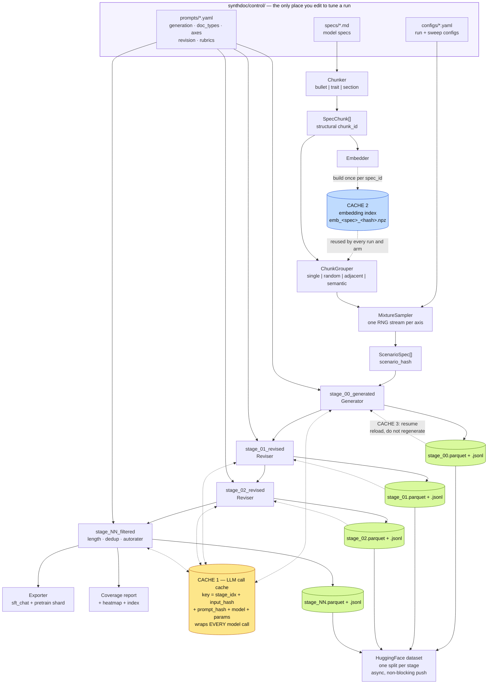

<!-- ABOUTME: Guide to the synthetic document generation pipeline: mental model, -->
<!-- ABOUTME: architecture, caching, how to run an ablation, and how to extend it. -->

# synthdoc — synthetic document generation

Model spec in, training corpus out. Self-contained: nothing in this package imports the
rest of the repo, and nothing in the rest of the repo needs to change to use it.

```python
from synthdoc import load_config, run_pipeline

cfg = load_config("synthdoc/control/configs/base.yaml", {"recipe.n": 500})
result = run_pipeline(cfg)
print(result.exports["main"])   # SFT chat JSONL, ready for training
```

```bash
uv run python -m synthdoc.cli run --config base.yaml --smoke   # offline, 8 docs, free, no API key
uv run python -m synthdoc.cli run --config base.yaml --n 2000
uv run python -m synthdoc.cli sweep --config revision_dose.yaml --n 300
```

---

## Why it is built this way

The three prior pipelines (Model Spec Midtraining, Teaching Claude Why, GDM's synthetic
document finetuning) made nearly every design choice on intuition and never ablated it.
This package exists to turn those unmeasured choices into measured ones. That goal drives
three properties that are unusual for a data generation tool:

| Requirement | How it is met |
|---|---|
| Any design choice must be testable without a code change | Every choice is a config field. Adding a document type or a revision strategy is a YAML entry, not a Python edit. |
| Comparisons must be cheap and paired | One RNG stream per axis, a content-addressed call cache, and stable IDs that join runs row for row. |
| The corpus must be inspectable at every stage | Every stage writes a **complete** snapshot with an identical schema, pushed as its own HF split. |

**The one rule that protects all of this:** an axis is never an `if` inside a generator.
If you find yourself writing `if tool_use:` or `if grouping == "semantic":` in a generator,
that is a missing plugin. Two of those and the axes stop being orthogonal, sweeps stop
being interpretable, and the whole point is lost. Treat it as review-blocking.

---

## Mental model

**`ScenarioSpec` is the load-bearing abstraction.** The sampler emits experimental
conditions; generators only render them. A 1-chunk document and a 4-chunk document are
the same code path — `chunks` is always a tuple, and `grouping_strategy` is recorded as
`"single"` for k=1 so those rows stay joinable with everything else.

```
spec text ──chunk──▶ SpecChunk[] ──group──▶ ScenarioSpec ──generate──▶ Document ──revise*──▶ ──filter──▶ corpus
```

### Identity rules (everything else depends on these)

| Hash | Definition | Constant across | Use it to join |
|---|---|---|---|
| `scenario_hash` | hash of the condition: chunk ids + chunk text + grouping + doc_type + axes + per-example seed | **sweep arms** | one arm against another |
| `doc_id` | `hash(scenario_hash, run_id)` | **stages** | one stage against the next |

So: *stage-over-stage is a join on `doc_id`; arm-over-arm is a join on `scenario_hash`.*
`doc_id` deliberately includes `run_id`, which is why cross-arm joins use `scenario_hash`.

Per-example seed is part of `scenario_hash`, so two examples that happen to draw the same
condition still get distinct ids rather than colliding.

---

## Architecture, and where the caching happens

Three independent caches. They cover different things, and knowing which one you are
hitting is the difference between a sweep that costs $200 and one that costs $8.



### Cache 1 — the LLM call cache (the one that matters)

`output/synthdoc_cache/`, content-addressed on
`(stage_idx, input_hash, prompt_hash, model, params)`. Every model call in the system goes
through it: generation, every revision pass, and every autorater vote.

What this buys you concretely:

- **Revision dose-response is nearly free.** Run the 3-pass arm; the 2-pass, 1-pass, and
  0-pass arms are all prefixes of it, so they replay from cache. Only the arms' filter
  stages cost anything new.
- **Re-running after a crash costs only the incomplete work.** Nothing already generated
  is regenerated.
- **Editing a prompt invalidates exactly what it should.** `prompt_hash` changes, so that
  stage re-runs; stages upstream of it do not.

`input_hash` is what keeps revision honest: a revision pass keys on the *rendered text of
its input document*, so if an upstream stage changed the document, the pass re-runs; if it
did not, the pass replays.

Independent autorater votes are kept genuinely independent — each rater varies its params,
so `n_raters: 3` is three distinct cache keys, not one answer counted three times.

### Cache 2 — the embedding index

Semantic grouping needs chunk embeddings. They are built **once per `spec_id`** and stored
as `.npz` next to the call cache, so this is not a per-run cost and every sweep arm shares
one index. Keyed on the chunk ids, chunk texts, and embedder name, so editing the spec
rebuilds it.

The default embedder (`hashing`) is offline, deterministic, and free, so nothing in the
pipeline needs a second API key. Switch to `openai` in the config when you want learned
embeddings for semantic grouping.

### Cache 3 — stage resume

Each stage writes a complete snapshot. With `resume: true` (the default), a stage whose
snapshot already exists is reloaded rather than recomputed. This is coarser than cache 1
and mostly saves the orchestration and parse work; cache 1 is what saves the money.

Deleting `stage_02_revised.*` and re-running re-executes that stage and everything after
it, and nothing before it.

---

## The stage sequence

```
stage_00_generated → stage_01_revised → … → stage_NN_filtered
```

Rules that follow from every stage writing a *complete* corpus rather than a delta:

- Any stage can be re-run without re-running the ones before it.
- Any two stages can be diffed as whole corpora.
- A stage is added or removed by editing the `revision:` list only — **the length of that
  list is the revision dose.**

Every row carries `stage_idx`, `stage_name`, and `input_doc_id`. "What did revision pass 2
actually change?" is a join, not a manual read:

```python
import pandas as pd
before = pd.read_parquet(f"{run}/stage_01_revised.parquet")
after  = pd.read_parquet(f"{run}/stage_02_revised.parquet")
d = before.merge(after, on="doc_id", suffixes=("_1", "_2"))
d["delta_words"] = d.n_words_2 - d.n_words_1
```

**Filtered-out documents are retained** with `filter_verdict = "drop"` and `dropped_by`,
never deleted. A filter you cannot inspect is a filter you cannot ablate.

---

## Running an ablation

A sweep is a base config plus **one** varied axis plus a list of arms. Multi-axis sweeps
are rejected at validation — with two axes moving, an arm difference is unattributable.

```yaml
base: base.yaml
axis: generation.model
n: 300
arms:
  - {name: sonnet45, value: anthropic/claude-sonnet-4.5}
  - {name: haiku45,  value: anthropic/claude-haiku-4.5}
```

Use `base_overrides:` to hold a confound fixed. It is applied identically to every arm, so
it cannot introduce a second axis:

```yaml
axis: recipe.grouping
base_overrides:
  recipe.chunks_per_example: {2: 1.0}    # compare grouping strategy, not group size
```

### Paired seeds — the highest-leverage detail here

Every arm samples from the same seed, and each decision draws from its **own RNG stream**
keyed on `(seed, example_index, decision_name)`. Changing the `doc_type` mixture perturbs
only the doc_type draw; every example's chunks, grouping, and other axes stay bit-identical
across arms. A single sequential RNG would reshuffle everything downstream of the first
changed draw and destroy the pairing.

The sweep runner **checks pairing before spending anything** and states the result:

- Axes downstream of sampling (`generation.model`, `revision`, `filters`) → **100% paired**,
  arms join row for row on `scenario_hash`.
- Axes inside the recipe (`recipe.grouping`, `recipe.chunks_per_example`) → partially paired
  by construction. The report says so and gives the shared fraction rather than pretending.

Dry-run a sweep to see the pairing without generating anything:

```bash
uv run python -m synthdoc.cli sweep --config grouping_strategy.yaml --dry_run
```

Shipped sweeps in `control/configs/sweeps/`: `generator_model`, `revision_dose`,
`grouping_strategy` — the three questions the prior pipelines left open.

---

## Extending it

Everything is a plugin resolved by name from a registry.

| Interface | Kind | Built in |
|---|---|---|
| `Chunker.chunk(spec)` | `chunker` | bullet, trait, section |
| `ChunkGrouper.group(chunks, k, rng)` | `grouping` | single, random, adjacent, semantic |
| `Generator.generate(scenario)` | `doc_type` | *(prompt-driven — no Python needed)* |
| `Reviser.revise(document)` | `reviser` | *(prompt-driven — no Python needed)* |
| `Filter.evaluate(document)` | `filter` | length, embedding_dedup, autorater |
| `Exporter.write(corpus)` | `exporter` | sft_chat, pretrain_text |
| `LLMClient.complete(...)` | `llm` | openrouter, echo |
| `Embedder.embed(texts)` | `embedder` | hashing, openai |

**A new document type usually needs no Python at all.** Add an entry to
`control/prompts/doc_types.yaml` and a weight in the recipe; the generic
`PromptedGenerator` serves it. Same for a new revision strategy
(`control/prompts/revision.yaml`) and a new axis value (`control/prompts/axes.yaml`).

Write Python only when the behaviour is not expressible as a prompt — e.g. a doc type that
needs custom output parsing:

```python
from synthdoc import register
from synthdoc.plugins.generators import PromptedGenerator

@register("doc_type", "tool_trace")
class ToolTraceGenerator(PromptedGenerator):
    def generate(self, scenario): ...
```

Then import the module in `synthdoc/plugins/__init__.py` so it registers.

`uv run python -m synthdoc.cli registry` lists everything currently registered and declared.

---

## Output layout

```
output/synthdoc/<run_id>/
  stage_00_generated.parquet     # snapshot: identical schema at every stage
  stage_00_generated.jsonl       # full fidelity incl. lineage (needed to re-run a stage)
  stage_01_revised.{parquet,jsonl}
  stage_NN_filtered.{parquet,jsonl}
  manifest.json                  # config, git sha, seeds, thresholds, agreement, cost
  coverage_report.md             # greppable numbers, emitted every run
  coverage_heatmap.png           # pink = zero coverage
  coverage_index.parquet         # one row per (doc, chunk) for slicing
  export/corpus_chat.jsonl       # SFT handoff
  export/pretrain_shard_text.jsonl
output/synthdoc_cache/           # cache 1 (calls) + cache 2 (embeddings)
output/synthdoc_sweeps/<sweep_id>/sweep_report.md
```

On HuggingFace: `LASR-Callum/synthdoc-<run_id>`, one split per stage, identical schema
across splits, `manifest.json` at the repo root. Pushes are **asynchronous and
non-blocking** — a failed push warns, leaves local parquet as the source of truth, and
never kills a run. Re-running a stage writes a new repo revision rather than overwriting,
so earlier comparisons stay reproducible.

---

## Reporting

Emitted automatically at the end of every run, no separate invocation:

- **Spec coverage** — chunks never used, chunks in the bottom decile, and the count of
  empty `(chunk × doc_type)` cells. Holes are the failure mode that silently limits what
  the finetuned model learns, so they are stated as a number, not left to be discovered.
- **`chunk_id × doc_type`**, **`doc_type × stakes_holder`**, **`doc_type × grouping_strategy`**.
- **Axis marginals against their target mixture** — catches a sampler or filter that is
  quietly skewing the corpus.
- **Stage-over-stage** length drift, error counts, and cost.
- **Inter-rater agreement** whenever `n_raters > 1`: mean spread, exact-agreement rate, and
  the fraction of documents where raters straddled the keep threshold. A rubric raters
  cannot apply consistently is visible rather than assumed good.

---

## Cost control

- `budget_usd: 25` aborts the run when cumulative cost passes it, after writing the
  snapshot for the completed stage. Because of cache 1, resuming after raising the budget
  costs only the remaining work.
- `--smoke` runs offline on the `echo` provider: no API key, no spend, every stage exercised.
- The manifest records `cost_usd_total`, per-stage cost, cache hit/miss counts, and any
  models missing from the price table.

---

## Tests

```bash
uv run pytest tests/test_synthdoc_*.py -q     # 103 tests, offline, ~3s
```

The load-bearing ones, if you change something and want to know what you broke:

- `test_changing_one_axis_leaves_the_others_bit_identical` — the paired-sweep property.
- `test_schema_is_identical_across_stages` + `test_filter_columns_exist_before_the_filter_stage`
  — stage snapshots stay comparable.
- `test_doc_id_joins_stages_row_for_row` — the identity rules.
- `test_second_run_is_served_from_cache` — cache 1 actually works.
- `test_multi_axis_sweep_is_rejected` — the review-blocking rule.
- `test_dropped_documents_are_retained_with_a_verdict` — filters stay inspectable.
